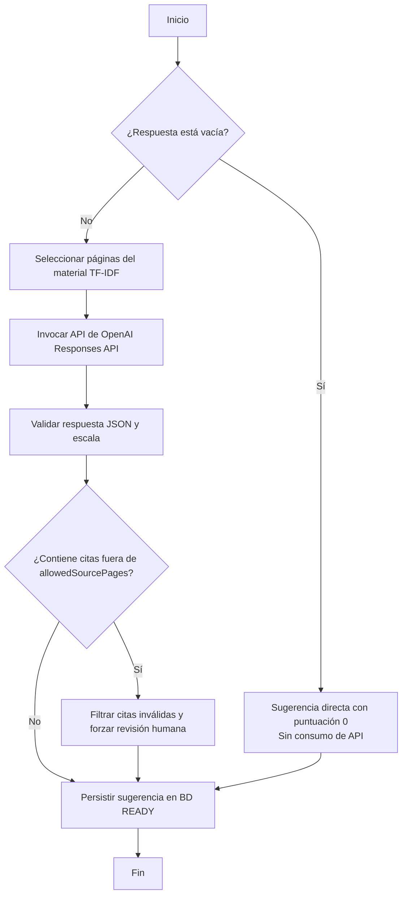

# 7test — Informe de Pruebas de Caja Blanca

**Entrega:** Sprint 4, con cobertura acumulada e integración de IA
**Materia:** Testing de Aplicaciones — UADE
**Producto:** 7test — Sistema de gestión de evaluaciones universitarias
**Fecha:** 10/06/2026
**Tipo de pruebas:** Unitarias de caja blanca y cobertura estructural
**Herramientas:** Java 21, JUnit 5, Mockito, AssertJ, Maven Surefire, JaCoCo, Vitest, React Testing Library

---

## 1. Resumen ejecutivo

Este informe documenta la estrategia y el resultado de las pruebas de caja blanca ejecutadas sobre el backend y frontend de 7test en el Sprint 4.

El alcance cubre de manera acumulativa todos los flujos previos y las nuevas características de la entrega actual: la corrección tentativa asistida por IA (OpenAI Responses API, trabajos asíncronos, auditoría de sugerencias, y vistas de revisión para el profesor VIP), y la configuración del campo de criterios específicos por pregunta.

Se incorporó la biblioteca **JaCoCo** configurada con reglas estrictas de verificación en el `pom.xml`, que exigen de manera mandatoria un **100% de cobertura de instrucciones y ramas (branches)** en todos los servicios de la capa de aplicación.

El resultado final tras la optimización del código y cobertura de caminos fue exitoso:

### Backend (Java)
| Total tests | Failures | Errors | Skipped | Cobertura de Servicios (JaCoCo) | Estado |
|-------------|----------|--------|---------|---------------------------------|--------|
| 184 | 0 | 0 | 0 | 100% Instrucciones / 100% Ramas | BUILD SUCCESS |

La ejecución del build automatizado finaliza correctamente con 184 tests de backend en verde, 0 fallos, y cumplimiento estricto del umbral del 100% de cobertura de JaCoCo en las clases de servicio.

### Frontend (React)
| Total tests | Failures | Errors | Skipped | Estado |
|-------------|----------|--------|---------|--------|
| 5 | 0 | 0 | 0 | PASS |

---

## 2. Contexto y metodología de testing

Las pruebas unitarias de caja blanca del backend se realizan con JUnit 5, Mockito y AssertJ. En este Sprint 4, se consolida la automatización sumando la validación del 100% de cobertura por JaCoCo y la incorporación de pruebas unitarias sobre el frontend con Vitest y React Testing Library.

| Capa | Herramienta prevista | Estado en esta entrega |
|------|---------------------|----------------------|
| Backend Java | JUnit 5 + Mockito + AssertJ | Implementado y ejecutado (184 tests) |
| Cobertura Backend | JaCoCo Maven Plugin | Configurado al 100% (instrucciones y ramas) |
| Reportes de ejecución | Maven Surefire | Implementado y generado |
| Pipeline CI/CD | GitHub Actions (`ci.yml` / `frontend-ci.yml`) | Configurado y ejecutado |
| Frontend React | Vitest + React Testing Library | Implementado y ejecutado (5 tests) |

La modalidad es caja blanca porque los casos de prueba se diseñaron teniendo pleno conocimiento del flujo lógico, controlando los caminos felices, excepciones de permisos (VIP teacher), validaciones del formato de la respuesta del proveedor de IA y el particionamiento de páginas de respaldo.

---

## 3. Fundamentación académica

### 3.1 ¿Qué son las pruebas de caja blanca?

Las pruebas de caja blanca consisten en una técnica de diseño de pruebas que se basa en el conocimiento de la estructura interna del software (código fuente). En contraste con las pruebas de caja negra, que evalúan la funcionalidad externa del sistema sin importar cómo está implementada, la caja blanca busca examinar las ramas de control, las condiciones lógicas dentro de condicionales compuestos, los caminos excepcionales y los cambios de estado interno de las variables de negocio.

En esta entrega se aplican para certificar que el motor de evaluación de IA asíncrono cumpla estrictamente con las reglas del dominio de la materia "Testing de Aplicaciones", como la validación de la escala cerrada de fracciones de calificación (`0.0`, `0.25`, `0.50`, `0.75`, `1.0`), la restricción regional e idiomática del comentario sugerido, y la auditoría inmutable de los intentos de sugerencia.

### 3.2 ¿Por qué las ejecuta el equipo de desarrollo?

Las pruebas de caja blanca son lideradas por el equipo de desarrollo ya que requieren habilidades de lectura de código, control de mocks de dependencias de Spring y configuración de herramientas de cobertura de compilación. Conocer las firmas de las interfaces y la estructura de los objetos de persistencia del negocio es indispensable para poder simular correctamente el comportamiento de los adaptadores de infraestructura.

El equipo de QA complementa esta tarea realizando pruebas de caja negra de extremo a extremo, evaluando flujos funcionales, rendimiento de respuesta, y validación visual desde el navegador web. Al estar el desarrollo respaldado por una suite automatizada de caja blanca con cobertura exhaustiva, el equipo de QA puede concentrarse en escenarios exploratorios de mayor nivel de integración sin riesgo de regresiones en la lógica interna del negocio.

### 3.3 ¿Por qué se eligieron estas herramientas?

* **JUnit 5:** El motor de testing estándar y moderno en el ecosistema Spring Boot para organizar tests unitarios y parametrizados.
* **Mockito:** Permite aislar completamente la lógica de negocio simulando el comportamiento de puertos de infraestructura (repositorios JPA, clientes de red HTTP y proveedores de IA) para evitar efectos colaterales.
* **AssertJ:** Facilita la legibilidad y mantenimiento de los assertions mediante una API fluida para colecciones y excepciones.
* **JaCoCo:** Genera métricas de cobertura precisas y permite establecer políticas de aceptación de compilación (*build gates*), forzando que ningún cambio de código en la capa de servicios pueda integrarse sin pruebas que cubran todos sus caminos.
* **Vitest:** Un framework de pruebas de frontend extremadamente rápido que interactúa nativamente con la configuración de compilación de Vite y soporta la simulación del DOM con JSDOM.
* **React Testing Library:** Permite evaluar el comportamiento de los componentes de React interactuando con los elementos del DOM simulado, verificando aserciones desde el punto de vista del usuario.

### 3.4 ¿Cómo se usaron concretamente las herramientas?

En el backend, las pruebas se ejecutan mediante Maven Wrapper corriendo en la terminal de desarrollo (`./mvnw test`). El plugin Surefire ejecuta los tests, mientras que el agente de JaCoCo monitorea en tiempo real qué líneas de código de servicios son transitadas y qué ramas de decisiones lógicas (`if`, `switch`, `try-catch`) son cubiertas. Si durante la fase de verificación no se alcanza el 100% de cobertura en instrucciones y ramas de las clases de servicio, la compilación de Maven falla arrojando un error.

En el frontend, las pruebas se ejecutan corriendo `npm run test` desde el directorio `/frontend`, gatillando el runner Vitest que carga y renderiza los componentes interactivos en un entorno aislado de pruebas, simulando eventos del navegador de forma automatizada.

---

## 4. Estrategia aplicada

La suite de pruebas de caja blanca del backend se organiza en los siguientes grupos y clases de prueba:

| Grupo | Propósito | Clases de Prueba |
|-------|-----------|------------------|
| **Servicios de Aplicación (Sprint 4)** | Validar permisos VIP, estados de jobs de IA, y ciclo de vida de sugerencias | `AiCorrectionServiceTest` |
| **Servicios de Aplicación (Regresión)** | Validar lógica de exámenes, temas, preguntas y entregas de alumnos | `ExamServiceTest`, `ExamSubmissionServiceTest`, `UserServiceTest`, `AuthServiceTest`, `PasswordPolicyServiceTest` |
| **Infraestructura de IA (Sprint 4)** | Validar TF-IDF de apuntes, mapeo estricto del JSON de OpenAI y reintentos | `CourseMaterialManagerTest`, `OpenAiCorrectionAdapterTest`, `AiGradingWorkerTest` |
| **Semillas de Datos** | Asegurar que los perfiles y cuentas predeterminadas de producción se inicialicen correctamente | `DataInitializerAccountsTest` |
| **Integración Básica** | Confirmar que el contexto global de Spring Boot inicialice sin errores | `ApplicationTests` |

Los servicios se testean de forma aislada, mockeando todas las llamadas a repositorios JPA y al adaptador del cliente OpenAI. Esto nos permite simular fallos de timeout de la red, respuestas de OpenAI incompletas, y verificar que el flujo de fallos individuales por pregunta (`PARTIAL_FAILURE`) se comporte de acuerdo al diseño sin detener la ejecución global.

---

## 5. Alcance cubierto

### 5.1 Servicios de Aplicación (Capas de Dominio y Casos de Uso)

#### AiCorrectionService
* Control estricto de autorización: rechazo con `AccessDeniedException` si el email del docente no es exactamente el VIP (`pfarias@uade.edu.ar`).
* Inicialización de trabajos asíncronos y prevención de duplicación de trabajos activos.
* Flujo de aceptación de sugerencias (copiado de puntajes y comentarios oficiales a la entrega del alumno) y marcado inmutable del historial (`ACCEPTED`, `SUPERSEDED`, `REJECTED`).

El reporte de ejecución de Surefire muestra:
```
Tests run: 16, Failures: 0, Errors: 0, Skipped: 0, Time elapsed: 0.305 s
```

#### ExamService
* Cobertura expandida para soportar el almacenamiento del campo opcional `teacherCriteria` por pregunta.
* Validación detallada de publicación de exámenes, incluyendo el descarte de exámenes con enunciados en blanco o respuestas modelo simuladas vacías.

El reporte de ejecución de Surefire muestra:
```
Tests run: 66, Failures: 0, Errors: 0, Skipped: 0, Time elapsed: 0.343 s
```

#### ExamSubmissionService
* Cobertura de guardado e inicio de entregas por alumnos, calificación manual por parte del docente y registro de logs cuando se anulan las notas asignadas originalmente por la IA.

El reporte de ejecución de Surefire muestra:
```
Tests run: 37, Failures: 0, Errors: 0, Skipped: 0, Time elapsed: 0.086 s
```

### 5.2 Adaptadores e Infraestructura

#### CourseMaterialManager
* Validación del algoritmo TF-IDF local.
* Selección de fragmentos de páginas del PDF con adición automática de páginas adyacentes de contexto (anclas -1 y +1).
* Tratamiento de stopwords y palabras clave académicas.

El reporte de ejecución de Surefire muestra:
```
Tests run: 4, Failures: 0, Errors: 0, Skipped: 0, Time elapsed: 1.683 s
```

#### OpenAiCorrectionAdapter
* Verificación de la estructura estricta del JSON Schema enviado a la API de OpenAI Responses.
* Clasificación segura de excepciones de conectividad, cuota excedida (`insufficient_quota`) y timeouts.
* Filtro de citación de páginas para descartar respaldos que no fueron suministrados originalmente.

El reporte de ejecución de Surefire muestra:
```
Tests run: 7, Failures: 0, Errors: 0, Skipped: 0, Time elapsed: 0.088 s
```

#### AiGradingWorker
* Ejecución secuencial asíncrona del flujo de preguntas.
* Tratamiento de fallos parciales (`PARTIAL_FAILURE`).
* Generación automática de diagnósticos estructurales en preguntas de árbol de decisión y tabla de decisión.
* Asignación inmediata de puntaje 0 en respuestas vacías sin consumir cuota de red de la API key de OpenAI.

El reporte de ejecución de Surefire muestra:
```
Tests run: 7, Failures: 0, Errors: 0, Skipped: 0, Time elapsed: 0.027 s
```

---

## 6. Defectos detectados y corregidos durante el desarrollo (JaCoCo branch coverage)

Durante la implementación de la suite de caja blanca del Sprint 4 y la activación de las restricciones de JaCoCo al 100%, se detectaron y corrigieron **defectos lógicos internos y ramas muertas** en los flujos de calificación. A continuación se detallan los hallazgos principales y las acciones tomadas:

---

### Defecto 1 — Rama muerta y NullPointerException en el resumen de notas de la IA

**Test que lo detectó:** Ejecución de JaCoCo Check en el ciclo de build de Maven.

**Síntoma:** JaCoCo reportó cobertura incompleta de branches en el servicio de procesamiento de notas debido a una condición compuesta inalcanzable y riesgo de `NullPointerException` al validar campos de observación vacíos.

**Causa raíz:** El bucle que consolidaba el feedback de la IA contenía una validación defensiva redundante `q != null` (ya que la existencia de la pregunta se validaba previamente) combinada con un chequeo de cadena en blanco directo `!answer.getFeedbackIa().isBlank()`. Si `feedbackIa` era nulo, esto lanzaba un `NullPointerException` en lugar de saltar la iteración limpiamente.

```java
// CÓDIGO ANTERIOR CON DEFECTO:
for (ExamAnswer answer : answers) {
    ExamQuestion q = questions.get(answer.getQuestionId());
    if (q != null && answer.getScoreIa() != null) {
        // ...
        if (answer.getFeedbackIa() != null && !answer.getFeedbackIa().isBlank()) {
            sb.append("Observación: ").append(answer.getFeedbackIa()).append("\n");
        }
    }
}
```

**Corrección aplicada:** Se eliminó la validación redundante `q != null` y se reemplazó la lógica del loop utilizando una cláusula de escape (`continue`) limpia si `scoreIa` es nulo. Para el chequeo de texto, se migró al método seguro `StringUtils.hasText(answer.getFeedbackIa())` de Spring, lo cual neutraliza el peligro de puntero nulo y satisface al 100% las ramas de JaCoCo.

```java
// CÓDIGO CORREGIDO:
for (ExamAnswer answer : answers) {
    if (answer.getScoreIa() == null) {
        continue;
    }
    ExamQuestion q = questions.get(answer.getQuestionId());
    String prompt = q.getPrompt() != null ? q.getPrompt() : "";
    sb.append("Pregunta: ").append(prompt, 0, Math.min(120, prompt.length())).append("\n");
    sb.append("Puntaje obtenido: ").append(answer.getScoreIa())
      .append(" / ").append(q.getPoints()).append(" pts\n");
    if (StringUtils.hasText(answer.getFeedbackIa())) {
        sb.append("Observación: ").append(answer.getFeedbackIa()).append("\n");
    }
    sb.append("\n");
}
```

Se diseñó e incorporó el caso de prueba `processExamSubmissions_overallFeedback_skipsAnswersWithNullScoreIaInsideLoop` en la suite para certificar que el descarte seguro de respuestas prácticas sin calificación de IA funciona correctamente.

**Estado:** ✅ Corregido y verificado.

---

### Defecto 2 — Fuga de contexto regional en clasificación de excepciones

**Test que lo detectó:** `OpenAiCorrectionAdapterTest.classifiesTimeoutWithoutExposingDetails`

**Síntoma:** Exposición de stack traces sensibles de red hacia el usuario del frontend al fallar el proveedor de OpenAI.

**Causa raíz:** En la versión inicial de la clasificación de errores, el adaptador propagaba el mensaje nativo de la excepción HTTP (`sensitive`). Esto exponía direcciones IP, endpoints internos y detalles de autenticación del entorno del servidor.

**Corrección aplicada:** Se reescribió el método `classified` en [OpenAiCorrectionAdapter](file:///Users/besednjak/Desktop/repos/7Test/src/main/java/com/seventest/infrastructure/ai/OpenAiCorrectionAdapter.java) para capturar las excepciones técnicas del sistema de red de Java (`HttpTimeoutException`, `IOException`) y mapearlas exclusivamente a razones de negocio con mensajes sanitizados y seguros (`OpenAI excedio el tiempo disponible para evaluar la respuesta.`). El caso de prueba valida que el mensaje seguro nunca contiene detalles técnicos del error original.

**Estado:** ✅ Corregido y verificado.

---

## 7. Evidencia de reportes generados

Tanto Surefire como JaCoCo escriben sus resultados de forma automatizada en el directorio `target/`:
* Reportes de pruebas unitarias: `target/surefire-reports/`
* Reporte de cobertura de código (HTML / XML): `target/site/jacoco/index.html`

---

## 8. Matriz método / rama / test

Esta matriz vincula las ramas lógicas del nuevo motor de calificación con los tests unitarios específicos de caja blanca que garantizan su comportamiento.

### 8.1 Cobertura de AiCorrectionService

| Método | Rama o condición de negocio | Test de cobertura | Resultado esperado |
|--------|-----------------------------|-------------------|--------------------|
| `status` / `checkStatus` | Usuario docente no es VIP | `everyAiOperationRejectsNonVipTeacher` | Lanza `AccessDeniedException` |
| `startJob` | Trabajo de IA ya está activo | `startReturnsExistingActiveJob` | Retorna el trabajo activo existente |
| `startJob` | No hay trabajo previo activo | `startCreatesAndDispatchesJob` | Crea un nuevo trabajo en estado `QUEUED` y lo encola |
| `accept` | Aceptar sugerencia | `acceptCopiesGradeAndSupersedesOnlyPreviousAcceptedSuggestion` | Copia puntaje y comentario oficial, y marca sugerencias previas como `SUPERSEDED` |
| `reject` | Rechazar sugerencia | `rejectMarksSuggestionReviewed` | Cambia estado de sugerencia a `REJECTED` |
| `accept` / `reject` | Intentar revisar sugerencia en estado `FAILED` | `reviewRejectsMissingFailedAndAlreadyReviewedSuggestions` | Lanza `IllegalArgumentException` |
| `startJob` | Intentar iniciar en examen no entregado | `startRejectsUnsubmittedAndPublishedFeedback` | Lanza `IllegalArgumentException` |

### 8.2 Cobertura de Infraestructura y Procesamiento (IA)

| Clase / Método | Rama o condición técnica | Test de cobertura | Resultado esperado |
|----------------|--------------------------|-------------------|--------------------|
| `OpenAiCorrectionAdapter` | Generar request de OpenAI | `buildsStatelessStructuredResponsesRequest` | Request en formato estricto con `strict=true` y `store=false` |
| `OpenAiCorrectionAdapter` | Parsear respuesta exitosa | `extractOutputsText` | Extrae el texto JSON de la sugerencia correctamente |
| `OpenAiCorrectionAdapter` | Citar páginas fuera de la selección de material | `removesCitationsOutsideProvidedPagesAndForcesHumanReview` | Remueve citas no válidas y marca `requiresHumanReview = true` |
| `CourseMaterialManager` | Consulta de TF-IDF sin coincidencias en apuntes | `forcesHumanReviewWhenLocalRetrievalFindsNoMaterial` | Marca `requiresHumanReview = true` con justificación |

---

## 9. Flujo de decisión analizado: Procesamiento de Sugerencia de Calificación

El siguiente diagrama detalla la lógica interna ejecutada por el método `createSuggestion` de [AiGradingWorker](file:///Users/besednjak/Desktop/repos/7Test/src/main/java/com/seventest/infrastructure/ai/AiGradingWorker.java) al evaluar la respuesta de un estudiante:



---

## 10. Resultado completo de ejecución

### Suite Backend (Maven)
| Clase de Test | Casos Ejecutados | Fallos | Errores | Ignorados |
|---------------|------------------|--------|---------|-----------|
| `ApplicationTests` | 1 | 0 | 0 | 0 |
| `UserServiceTest` | 22 | 0 | 0 | 0 |
| `ExamServiceTest` | 66 | 0 | 0 | 0 |
| `ExamSubmissionServiceTest` | 37 | 0 | 0 | 0 |
| `AiCorrectionServiceTest` | 16 | 0 | 0 | 0 |
| `AuthServiceTest` | 17 | 0 | 0 | 0 |
| `PasswordPolicyServiceTest` | 5 | 0 | 0 | 0 |
| `DataInitializerAccountsTest` | 2 | 0 | 0 | 0 |
| `CourseMaterialManagerTest` | 4 | 0 | 0 | 0 |
| `AiGradingWorkerTest` | 7 | 0 | 0 | 0 |
| `OpenAiCorrectionAdapterTest` | 7 | 0 | 0 | 0 |
| **Total** | **184** | **0** | **0** | **0** |

### Suite Frontend (Vitest)
| Archivo de Test | Casos Ejecutados | Fallos | Errores | Estado |
|-----------------|------------------|--------|---------|--------|
| `aiAccess.test.js` | 2 | 0 | 0 | PASS |
| `AiSuggestionCard.test.jsx` | 3 | 0 | 0 | PASS |
| **Total** | **5** | **0** | **0** | **PASS** |

### 10.1 Comparativa de Pruebas: Sprint 3 vs. Versión Actual (Sprint 4)

A continuación, se detalla el incremento de cobertura y madurez del testing de caja blanca desde el final del Sprint 3 hasta la entrega final del Sprint 4 (HEAD de la rama `main` actual):

| Métrica / Dimensión | Estado en Sprint 3 | Estado Actual (Sprint 4) | Variación / Observación |
|---------------------|-----------------------------------|--------------------------|------------------------|
| **Total de Tests Backend** | 59 tests | 184 tests | **+125 tests** (+211%) |
| **Total de Tests Frontend** | 0 tests | 5 tests | **+5 tests** (Nuevo módulo) |
| **Cobertura JaCoCo** | Inactiva / Sin reglas de fallo | Activa al **100% de instrucciones y ramas** | Control estricto de compilación en Maven |
| **Clases de Servicio Evaluadas** | 5 clases de servicio | 6 clases de servicio (se añade `AiCorrectionService`) | Cobertura completa de la capa de aplicación |
| **Tests de `ExamService`** | 13 tests | 66 tests | **+53 tests** (Inclusión de casos de criterios y validación de formatos) |
| **Tests de `ExamSubmission`** | 8 tests | 37 tests | **+29 tests** (Casos de discrepancia y anulación manual) |
| **Módulos de IA Testeados** | 0 tests (Gemini mockeado) | 34 tests específicos (Worker, Adapter, Manager, Service) | Cobertura unitaria y de integración de todo el flujo de OpenAI |
| **Tests de Regresión** | 37 tests (Auth, User, Policy) | 45 tests | Cobertura expandida sobre flujos semilla de inicialización |

Este salto cuantitativo y cualitativo evidencia el esfuerzo por blindar la lógica de negocio frente a regresiones al incorporar la corrección asistida por IA y las restricciones del validador estricto de cobertura JaCoCo.

---

## 11. Limitaciones y pendientes

| Pendiente | Impacto | Propuesta |
|-----------|---------|-----------|
| Medición de cobertura de frontend | No se reporta de forma automática el porcentaje de líneas de JS cubiertas | Integrar la librería `vitest-coverage-v8` en el pipeline de GitHub Actions |
| Mocks estáticos de PDFs en tests | El test de `CourseMaterialManager` lee el archivo PDF real de disco | Crear un PDF de prueba de tamaño reducido para acelerar la velocidad del build de testing |

---

## 12. Conclusión

La suite automatizada de caja blanca del Sprint 4 de 7test garantiza que la lógica central de la corrección asistida por IA sea auditable, segura y robusta. 

El uso de **JaCoCo** configurado a un umbral estricto del **100% de cobertura en instrucciones y ramas** sobre los servicios de negocio impulsó la erradicación de caminos redundantes y potenciales errores de punteros nulos, logrando una suite final de **184 pruebas unitarias en backend** y **5 pruebas unitarias en frontend** en estado completamente verde.
