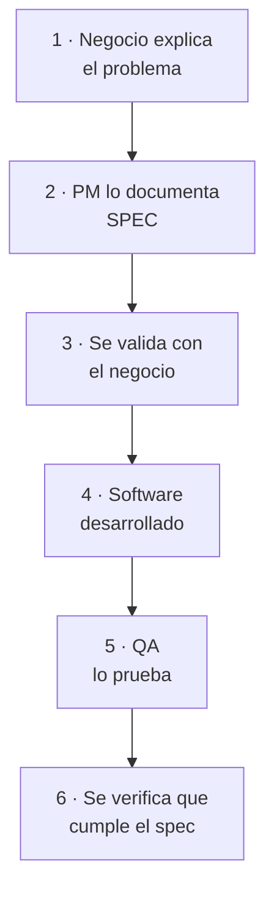
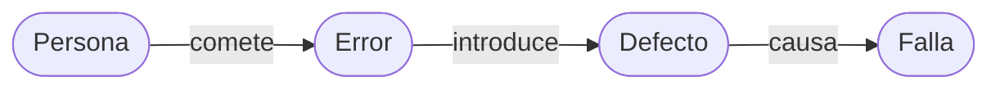
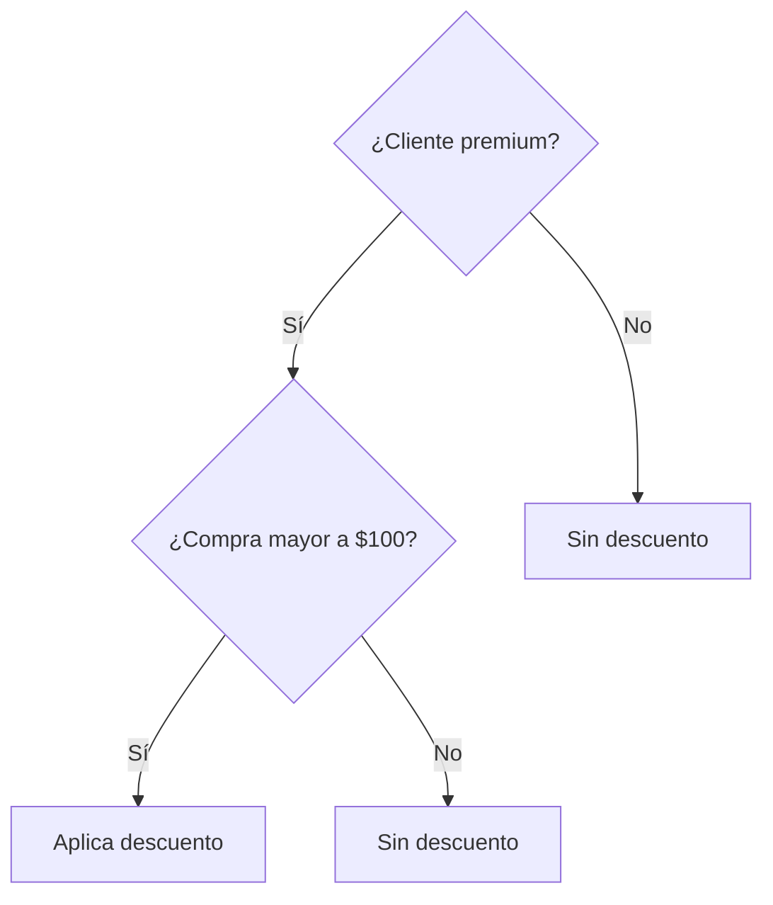
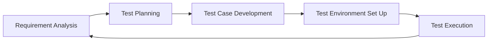

# Testing — 1P

## Testing (planificacion, preparacion, evaluacion)

- Es un proceso que comprende un conjunto de actividades que incluyen la planificación, preparación y evaluación del software su objetivo es asegurar la calidad, es decir, que se cumplan los requerimientos.

### Componentes evaluados

- **Funcionamiento** → si hace lo que debería hacer.
- **Rendimiento** → qué tan rápido / eficiente lo hace.

## Calidad (sistema, componente, proceso)

- La calidad es el grado en el cual un sistema, componente o proceso cumple con las expectativas / necesidades del usuario / cliente.

### Motivos principales para hacer testing

- Mejorar calidad.
- Mejorar experiencia de usuario.
- Mejorar seguridad.
- Evitar errores.
- Evitar problemas en producción.

> 📌 No se puede probar todo — hay limitaciones y presión del negocio.

## Validación vs. Verificación

| Validación | Verificación |
|---|---|
| Se realiza antes del desarrollo. | Se realiza después del desarrollo. |
| Consiste en confirmar que lo que se va a construir es realmente lo que necesita el negocio. | Consiste en comprobar que el sistema funciona según lo indicado. |
| Implica interactuar con el usuario para asegurar que la interpretación del problema es correcta. | Asegurar que lo construimos correctamente. |
| Asegurar que construimos lo correcto. | |

> **SPEC:** describe el problema del negocio y su solución.

### Flujo

## Testers

### QA — Quality Assurance · orientado a procesos (previene)

- Se enfoca en asegurar la calidad en todo el proceso.
- Se encarga de definir la estrategia de testing, estándares y cómo se va a probar → **define cómo probar**.

### QC — Quality Control · orientado al producto (detecta)

- Se enfoca en controlar la calidad del producto final.
- Se encarga de ejecutar las pruebas, detectar errores y validar el funcionamiento del sistema → **ejecuta pruebas**.

### UAT — User Acceptance Testing

- Es el testing realizado por el usuario final.
- Su objetivo es ver que el sistema cumple con sus expectativas en el contexto real.

> **Lo que no es medible, no tiene calidad.**

## Bugs

- **Error:** equivocación humana (en definición o programación).
- **Defecto:** problema en el sistema causado por ese error.
- **Falla:** manifestación del defecto en producción.

## Los 7 fundamentos del testing

### 1. La prueba muestra la presencia de defectos, no su ausencia (Fantasma)

### 2. La exhaustividad es imposible (Cansado)

### 3. Detección temprana de defectos (llega rapido)

Mientras antes se detecte un error, menor es el costo de corregirlo.

### 4. Agrupación de defectos (a conseguirse con paretto)

A mayor complejidad, mayor el nivel de defectos hallados. Se basa en la regla **80/20**: aprox. el 80 % de los defectos provienen del 20 % del código, que suele coincidir con las funcionalidades nuevas y las partes más complejas.

### 5. Paradoja del pesticida (para matar bichos)

Si las pruebas se repiten una y otra vez, eventualmente esas pruebas no encontrarán nuevos defectos. Para mantener la efectividad es necesario cambiar las pruebas, condiciones, datos, entorno, etc.

### 6. Dependiente del contexto (y le tira un chiste)

### 7. La ausencia de defectos es una falacia (sobre su papa ausente)

## Clasificación de pruebas

| Caja Negra | Caja Blanca |
|---|---|
| Evalúan la funcionalidad de un sistema sin necesidad de conocer su estructura interna o código. | Se examina la estructura interna de un sistema. |
| Los evaluadores se centran en probar las entradas y salidas del sistema. | Involucra la inspección de código fuente, rutas, datos con cobertura exhaustiva. |
| ↓ | ↓ |
| Probamos los requisitos funcionales desde el exterior. | Probamos las funciones internas de un módulo. |

### Tipos de pruebas

#### De Caja Negra

### Funcionales

Verifican que un sistema realice lo que está establecido en los requerimientos funcionales. Es el qué hace el sistema.

- **Componentes:** funcionalidad específica o módulo aislado.
- **Integración funcional:** evalúa cómo interactúan distintos componentes entre sí. ↓ mayor cobertura.
- **Sistema:** todo lo que puedo probar en base al contexto.
- **Aceptación (UAT):** es la prueba final del cliente.

#### No funcionales

Evalúan cómo funciona el sistema, no el qué hace.

- **Rendimiento:** mide velocidad y eficiencia del sistema, FPS, etc.
- **Carga / estrés:** cómo responde el sistema con muchos usuarios o situaciones extremas.
- **Usabilidad:** buen UX / UI.
- **Mantenimiento:** qué tan fácil es modificar o mantener el sistema.
- **Confiabilidad:** estabilidad del sistema en el tiempo.
- **Portabilidad:** evalúa si el sistema funciona en distintos entornos.
- **Seguridad informática:** protección ante ataques.
- **Implementación:** proceso de despliegue o instalación del sistema.

#### Cambios

Cuando se modifica un sistema se deben hacer pruebas adicionales.

- **Confirmación:** para verificar que un bug fue corregido correctamente.
- **Regresión:** se prueba lo no modificado para ver que no se rompa.
- **Smoke:** es una prueba rápida y básica.

#### De Caja Blanca

- **Unitarias:** hechas sobre funciones o módulos individuales.
- **Integración técnica:** cómo interactúan módulos entre sí (APIs, DB, código).
- **Rendimiento:** evalúa eficiencia del código internamente (memoria, óptimo).
- **Carga / estrés:** comportamiento técnico del sistema bajo carga.
- **Seguridad:** vulnerabilidades a nivel código o arquitectura.

## Técnicas de pruebas

> Métodos que permiten decidir **qué** probar.

### 1. Partición de clases de equivalencia → grupos · CN

- Consiste en dividir los datos en grupos donde todos se comportan de manera similar / igual.
- Se prueba un representante de c/grupo en lugar de todos los valores.
- Permite reducir la cant. de pruebas manteniendo buena cobertura.

**Ej:** el sistema acepta # del 1 al 100.

| Clases | Prueba |
|---|---|
| # < 1 inválidos | Ej. 0 |
| 1 ≤ # ≤ 100 válidos | Ej. 50 |
| # > 100 inválidos | Ej. 101 |

### 2. Valores límite o frontera → extremos · CN

- Consiste en probar los valores extremos de un rango, ya que en esos puntos es donde suelen ocurrir errores.
- Se suele confundir el `>` con `≥` o `<` y `≤`.

**Ej:** se puede votar de 16 en adelante hasta los 65 (16 ≤ # ≤ 65).

Prueba:

- 15 inválido
- 16 lím inf
- 17 válido
- 64 válido
- 65 lím sup
- 66 inválido

### 3. Tabla de decisiones → combinaciones · CN

Se usa cuando hay múltiples condiciones combinadas que generan diferentes resultados.

1. Identificar condiciones (n).
2. Calcular combinaciones 2ⁿ.
3. Definir salidas.

> **Nota:** en el parcial, si las condiciones son entre 3 y 4, marcar resultados como **N/A** cuando no aplica (sí / sí).

**Ej:** aplica un descuento si el cliente es *premium* y la compra supera los $100. Con 2 condiciones → 2² = 4 combinaciones.

| Condiciones \ Caso | C1 | C2 | C3 | C4 |
|---|---|---|---|---|
| ¿Cliente premium? | Sí | Sí | No | No |
| ¿Compra > $100? | Sí | No | Sí | No |
| **→ Aplica descuento** | Sí | No | No | No |

### 4. Árboles de decisión → visual

Son una representación gráfica de las decisiones y sus posibles resultados; facilita la comprensión en escenarios complejos.

- Preguntas en círculos / nodos.
- Respuestas en ramas / aristas.
- Soluciones en rectángulos / hojas.

**Ej:** mismo caso del descuento, en formato árbol.

### 5. Casos de uso → flujo de usuario · CN

Se basa en cómo el usuario interactúa con el sistema.

**Ej:**

1. Usuario inicia sesión.
2. Selecciona producto.
3. Realiza compra.

**Notas:**

- **Include:** incluye otro caso. Ej.: realizar compra incluye autenticarse.
- **Extend:** es opcional o condicional. Ej.: realizar compra puede extenderse a aplicar descuento.

### 6. Unitarias por código → código

Son pruebas sobre el código; se prueban funciones, métodos, módulos.

**Ej:** se calcula el promedio.

- Se pasan los datos.
- Se verifica el resultado.

### 7. Por cobertura → cuánto pude

- Se enfoca en medir cuánto del sistema fue probado.
- `Coverage = casos probados / total de casos`.

**Ej:** 80 casos de 100 es 80 / 100 = 80 % coverage.

### 8. Mutantes → calidad de pruebas

Consiste en introducir errores artificiales al código para ver si las pruebas lo detectan; así se evalúa la calidad de las pruebas.

**Ej:** cambiar `+` por `-` y ver si los tests fallan.

## Factores de elección

- El contexto.
- Estándares de regulación.
- Requisitos y objetivos de la prueba.
- Niveles y clases de riesgo.
- Conocimientos y competencias del probador.
- Modelo del ciclo de vida.
- Uso del software.
- Experiencia previa en técnicas de prueba.
- Documentación, herramientas, tiempo y presupuesto.

## Proceso de testing — base

**Software Testing Life Cycle.** Aplica también a metodologías ágiles.

1. Se empieza con el análisis de los requerimientos. Se busca entender qué necesita el negocio, qué se espera del sistema y cuál es el problema.
2. Se realiza la planificación del testing: qué se va a probar, qué tipos de prueba y técnicas se van a aplicar, recursos disponibles (herramientas, personal), tiempo y presupuesto. **QA es clave.**
3. Se diseñan y documentan los casos de prueba con sus datos de entrada, pasos a ejecutar y los resultados esperados.
4. Se prepara el entorno / ambiente donde se prueba: dev (desarrollo), stage (pruebas) y prod (producción) se configuran (configs, FF).
5. Finalmente se ejecutan los casos de prueba, se comparan los resultados y, si detecta algún bug, se reporta para su corrección. Una vez corregido, se pueden volver a ejecutar las pruebas (confirmación y regresión).